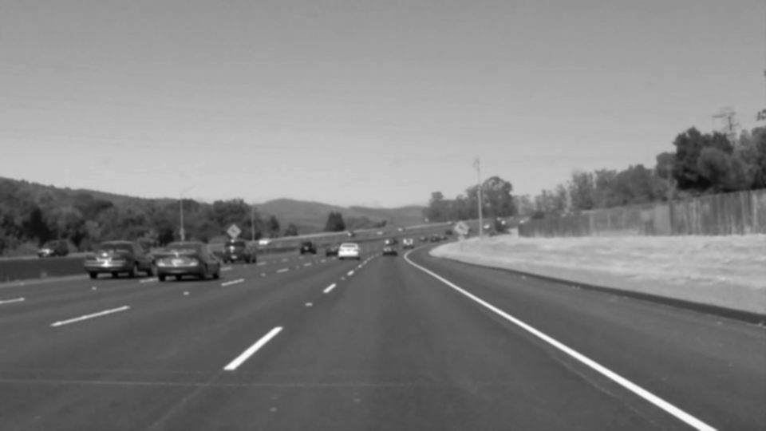
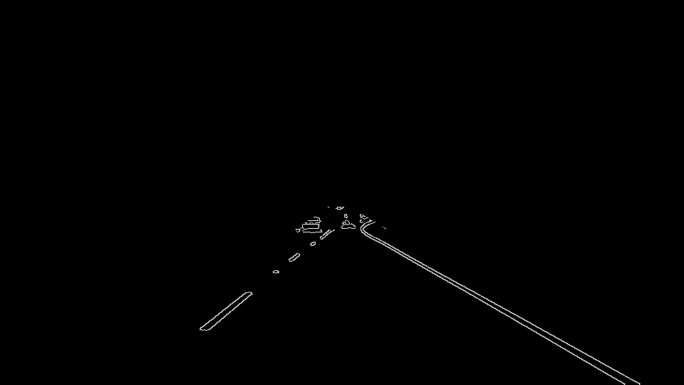
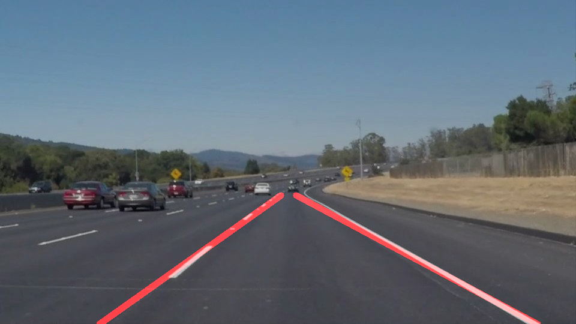

# **Finding Lane Lines on the Road**

### 1. Pipeline Description

My pipeline consisted of 5 steps 
1. I converted the image to grayscale and applied Gaussian smoothing to it. The kernel size is 5.

2. Based on the image in stpe 1, I applied Canny edge detection with `low_threshold = 50` and `high_threshold = 150`.

3. Here I applied a mask to the image in order to get the region of interest.

4. In this step, I first applied the Hough Transform to the masked image, and then modified the `draw_lines()` function to filter lines and extrapolate to the top and bottom of the lane.
I seperated line segments by their slopes, and then used function `polyfit()` to interpolate left line and right line, respectively.

### 2. Identify potential shortcomings with your current pipeline

1. The lines fitted to the lane lines shakes a lot in the vedio becuase there are some noise line segments other than lane line segaments during the interpolation process.
2. We are only fitting straight lines to the lane lines, so when it comes to big curve lanes, this pipeline may show poor results.
3. The filter and interpolation part in the pipeline has very bad results in the Challenge Video. It can't filter out the line segments of wall on the left side.

### 3. Suggest possible improvements to your pipeline

Improve the `draw_line()` function in order to detect lane lines more accurately.

